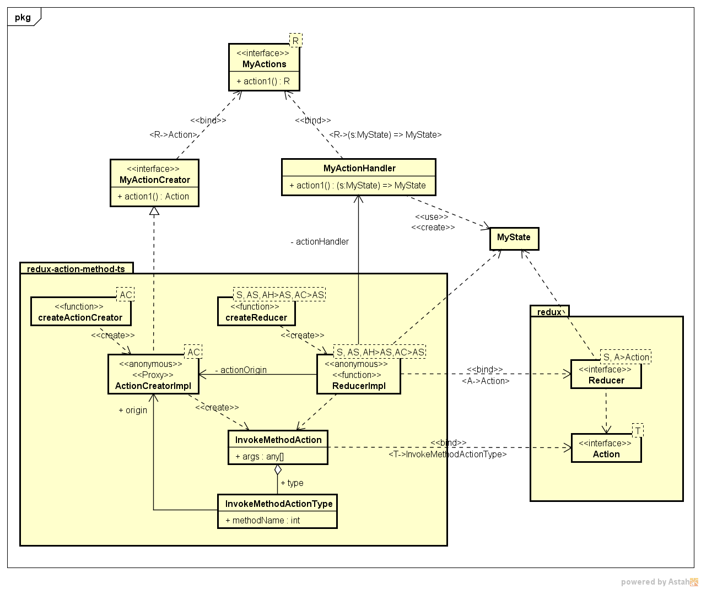

# redux-action-method-ts
Helper library to automatically map TypeScript methods to Redux actions.

## Usage

Install by `npm install redux-action-method-ts` or directly taking [the code](src/index.ts) (only one file) to your project.
See [the example](tests/example.ts) for the usage.

## Story

There are a few things I really hate with Redux when I studied about it recently:

1. Defining action type constants and creating action objects
2. Using switch-cases in reducer
3. Handling type-unsafe payloads passed from action to reducer

For a long-time object oriented design practitioner like myself, TypeScript and React seems to be a light of hope brought into the dark JavaScript GUI developemnt world. However, when I see Redux commonly used with React, I feel I am drawn back to the darkness again by the dirty programming model above.

So here is my thought that makes more sense, at least for me if not for everyone.

* Most of the time, an action can be equivalent to a method signature and its parameters that makes the state transition happen, if spoken in the object oriented terminologies. It is exactly like a method invocation packet created by an RPC client stub, and this analogy suggests that we should be able to come up with a generic mechanism to create actions based on the given interface definition without any manual effort.
* If we got an action containing a method signature and its parameters as discussed above, we should be able to implement a generic reducer that dispatches the action to the designated method on an _action handler_ object to make the actual state transition happen. This action handler should be bound with the reducer upfrount.
* Let's say we had an interface that exposes the requierd actions as methods (such as `increment()` and `add(x:number)` if it was a counter application) with the return type generic. Then we should be able to use this same interface both to create actions (by returning an action object) and to implement the action handler.

Putting those thoughs together, I would like to write my Redux actions and reducers like this pseudo code. If you liked this idea, see the [complete example](tests/example.ts) and use it in your project.

```typescript
import {Action, createStore} from "redux";
import {createActionCreator, createReducer} from "redux-action-method-ts"; // my fancy library

interface State { counter: number } // State for my counter application

// Define actions as an interface with the return type generic
// The return type will be specialized by action creators and action handlers respectively.
interface Actions<R> {
  increment(): R;
  add(x: number): R;
}

// Derive an action creator from the interface above
// A proxy of type Actions<Action> is created behind the scenes.
const actions = createActionCreator<Actions<Action>>();

// Implement the state transitions using the same interface
// Each method returns a function that takes the old state and returns the new state
// because the method itself does not take the state in the parameters.
class ActionHandler implements Actions<(s:State) => State> {
  increment() { return (s:State): State => ({...s, counter: s.counter + 1}) }
  add(x:number) { return (s:State): State => ({...s, counter: s.counter + x}) }
}

// Create a reducer by binding the action handler and the action creator above
const reducers = createReducer<State>(new ActionHandler(), actions, { counter: 0 });

// Now actions and reducers are ready to use.
const store = createStore(reducers);
store.dispatch(actions.increment());
store.dispatch(actions.add(5));
...
```

Also note that this approach is totally compatible with the usual Redux usage. You can use it when and only when you like it, and should be totally safe to mix it with other approaches.

## Object Model



## Conclusion

This small library allows you to use Redux without compromising your favorite object oriented design practice. All you need is to create an interface and an action handler as its implementation, then Redux actions and reducers can be automateically generated by a mechanism inspired by the traditional object oriented RPC. No boring action codes, no stoneageish switch-cases, and completely type-safe. May force be with the object oriented programmers!
